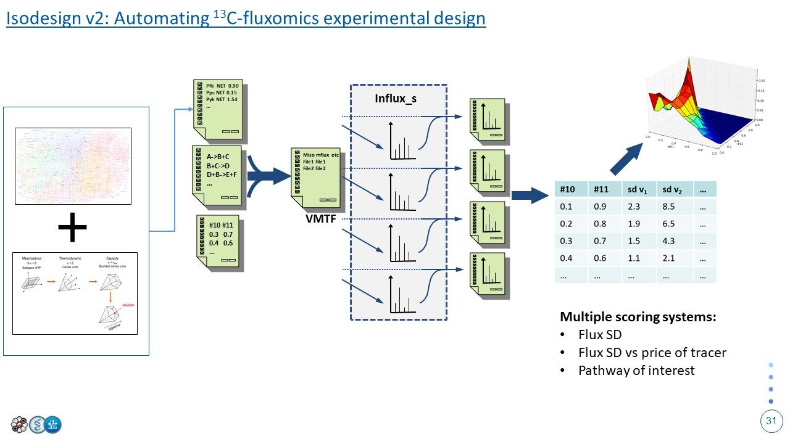

# IsoDesign
The objective of IsoDesign 2.0 is to provide simple and rapid 13C tracer design. Leveraging the influx_si software and through iterative minimization of in silico calculated fluxes standard deviations (SD), IsoDesign 2.0 will help researchers in selecting the best compromise between flux precision and tracer prices.

## Goal of tool

**The objective of IsoDesign 2.0 is to provide simple and rapid 13C tracer design.** Leveraging the [*influx_si* software](10.1093/bioinformatics/btr716) and through iterative minimization of *in silico* calculated fluxes standard deviations (SD), IsoDesign 2.0 will help researchers in selecting the best compromise between flux precision and tracer prices.

## Method

The method will be based on the same one used in the first version of [*IsoDesign*](https://doi.org/10.1002/bit.24997), with a number of key upgrades:
* **Use of influx_si's new mtf file system:** The new mtf system decouples the different sections of the ancient *ftbl* file into a number of subfiles (one subfile per *ftbl* section).
* **Calculated isotopic measurements as input**: the new mtf file system makes it possible to feed back run results as input
* **GSM integration (second phase?)**: Integrating the use of Genome Scale Models and FBA to get predicted fluxes as input for IsoDesign2 could greatly enhance tracer design capabilities
* **Cost as a scoring metric**

Here is a description of the steps that are going to be included in IsoDesign:

1. Initialize user parameters and launch the run

- Import the .netw file containing the metabolic network.
- Import the .tvar file containing the initial metabolic flux values (should they be constrained?) 
- ?+ .mflux containing measured extracellular flxes?
- Starting from the available tracers (U13C, 1-13C, etc for glc for example) and from a step size given by the user (10% for example), generate the different possible label inputs and add them to a series of .linp files that will be put in the input data folder. These labeled inputs should be added to the netw? (Glucupt_U, Glucupt_1, etc...)
- Generate the .vmtf file that links the first two files with all the different .linp files that have been generated.

Question: Simulation of parallel experiments?

2. Run the simulations

The next step is to run the simulations and get statistical information on the set of free fluxes **without** fitting measurements. Here is a list of options that will be passed on to influx:
* --prefix: path towards the network file
* --mtf: path towards the .vmtf file
* --noopt: this option is paramount as it will be essential to running the simulation without fitting the measurements. This let's influx simulate the labelling data for the different metabolites.
* --sens=mc[=Default_number_of_iterations]: number of iterations for the monte-carlo simulations if the user asked to run MCs

4. Run flux calculation and calculate precision on fluxes

This part is handled by influx. Testing is ongoing to know if reinjection is needed.

5. Generate the outputs: scores, sensitivity landscape & input ranks

The tool will have multiple outputs:
- **Table of scores**: this table will reference for each label input tested the score in different category: total sum of SDs, sum of SDs on selected fluxes, Sum of SDs vs tracer price, etc...
- **Sensitivity landscape**: cf plots made by IsoDesign v1 

To handle the coordination of the different parts of the program, we will create a Process class that will handle most 
of the steps initiated within the tool. Here is a visual description of the class:

## Interface

