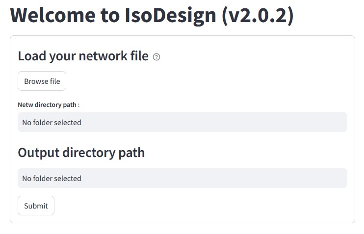
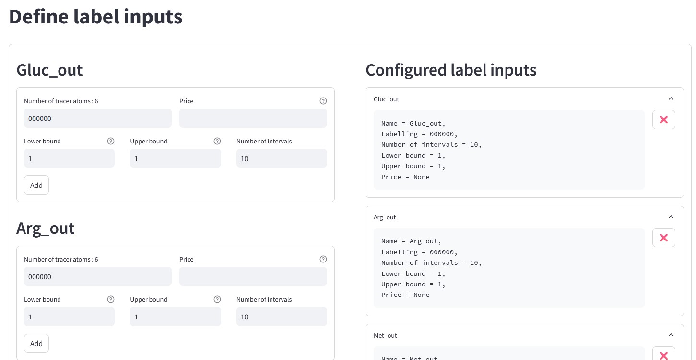
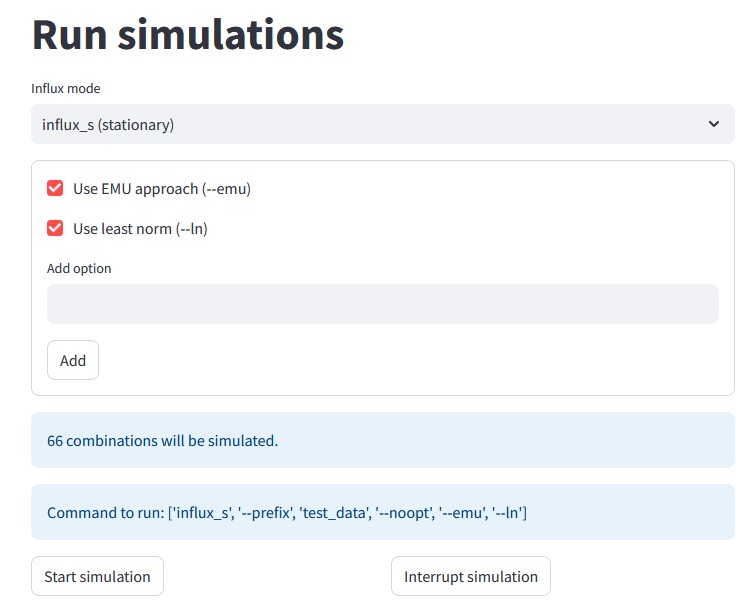
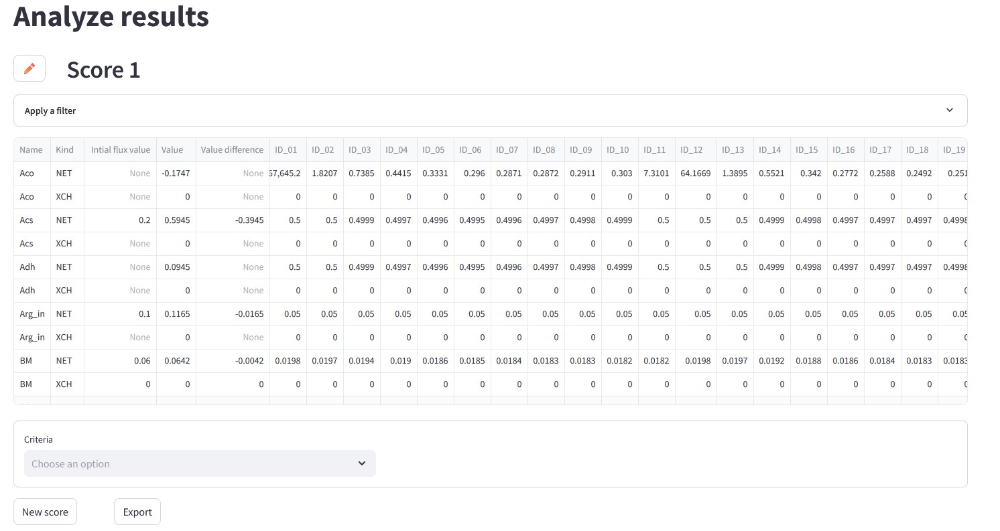

Quick start
============

In this section, we explain how to launch IsoDesign once it has been
installed on your system.

Graphical user interface
--------------------------------------

To open the Graphical User Interface, type in a terminal (e.g. Anaconda
Prompt if installed on Windows):

.. code-block:: bash

    isodesign

If you have installed the package in a specific environment, make sure to
activate it before starting IsoDesign.

IsoDesign interface will open in a new browser window:

Select your input network file (which should have a :file:`.netw` extension,
refer to :ref:`required_input_data_files` for more details).
By default, an output directory path is pre-configured, but you can modify
it if needed. Once ready, you click the "Submit" button to load your model
and explore its structure through a dedicated interface. Afterward, click on
"Next Page" to go to the next step. This will open the **Define label inputs** page.

In the page **Define label inputs**, you can define the available isotopic forms of
the substrate(s) and specify the desired proportions to be tested by setting
lower and upper bounds along with a number of intervals. Additionally,
you can preview the generated combinations before proceeding with simulations
(refer to the :ref:`labels_input` for more details).

In the **Simulation options** page, you can choose your desired simulation
mode: influx_s (stationary) or influx_i (instationary) (refer to the
:ref:`simulation_options` for more details).
Then, configure the simulation options and initiate the simulation. Once the
calculations are completed, you can proceed to the **Analyze results** page.

The **Analyze results** page allows you to visualize the results and apply one or
more scoring criteria to identify the optimal label input (refer to
:ref:`results` for more details).

.. note:: The process is continuously and automatically saved as a pickle file (:file:`.pkl`) in the output folder. To reopen the current processing state, just reopen this file by clicking on "Load a previous session" on the “Load data” page.

.. warning:: IsoDesign overwrites (results and processing) files if they already exist. So take care to copy your results elsewhere or to change the output path and/or filename if you want to protect them from overwriting.

Library
-------

IsoDesign is also available as a library (a Python module) that you can
import directly in your Python scripts:

.. code-block:: python

  import isodesign

.. .. seealso::  Have a look at our :ref:`API <Library documentation>` if you are interested in this experimental feature.