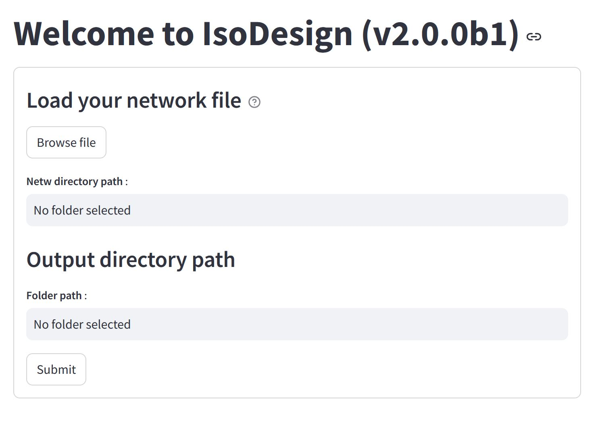

Quick start
============

In this section we will explain how to launch IsoDesign once it has been installed onto your system.

Graphical user interface
--------------------------------------

To open the Graphical User Interface, type in a terminal (e.g. Anaconda Prompt if installed on Windows):

.. code-block:: bash

    isodesign

If you have installed the package in a specific environment, make sure to activate it before starting IsoDesign.

IsoDesign interface will open in a new browser window :

Select your input network file (which should have a ".netw" extension. It's a :file:`tsv` format file, refer to the Tutorial for more details). 
By default, an output directory path is pre-configured, but you can modify it if needed. Once ready, you click the "Submit" button to load your model 
and explore its different elements. Afterward, click the "Next Page" button to proceed.

In the following page, **Labels input**, you can configure the isotopic composition of the substrates and specify the desire proportions by setting the
lower and upper bounds along with the number of intervals. Additionnally, you can preview the generated combinations before proceeding with simulations
(refer to the Tutorial for more details).

In the **Simulation options** page, you can choose your desired simulation mode : influx_s (stationary) or influx_i (instationary) (refer to the Tutorial for more details).
Then, configure the simulation options and initiate the simulation. 

The **Results** page allows you to view simulation outcomes and apply one or more scoring criteria (refer to the Tutorial for more details).

.. note:: The process is continuously and automatically saved as a pickle file (".pkl") in the output folder. To reopen the current processing state, just reopen this file by clicking on "Load a session - Browse files" on on the “Upload data” page.

.. warning:: IsoDesign overwrites (results and processing) files if they already exist. So take care to copy your results elsewhere or to change the output path and/or filename if you want to protect them from overwriting.

Library
-------

IsoDesign is also available as a library (a Python module) that you can import directly in your Python
scripts:

.. code-block:: python

  import isodesign

.. seealso::  Have a look at our :ref:`API <Library documentation>` if you are interested in this feature.