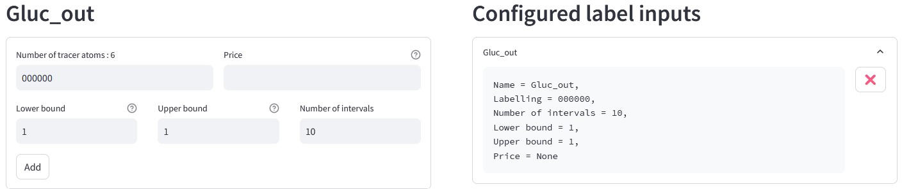

Tutorial
========
This tutorial will guide you through the main steps of IsoDesign, from loading a flux model to visualizing and interpretating design results.

Load data
------------------------

.. _required_input_data_files:

Required input data files
~~~~~~~~~~~~~~~~~~~~~~~~~

IsoDesign uses a specific file format for isotopic models of metabolic networks, introduced in `influx_si <https://influx-si.readthedocs.io/en/latest/>`_, the :file:`Multiple TSV File` (MTF) format.  
MTF files are tab-separated files (TSV), each with a specific content (list of reactions, isotopic measurements, etc). Each file is identified by a specific suffix
indicating the type of information it contains. For more details on these files, please refer to the `influx_si software documentation 
<https://influx-si.readthedocs.io/en/latest/manual.html#>`_. 

IsoDesign uses as main file **a network file** (with the :file:`.netw` extension) as input. After selecting the input file, all associated MTF files sharing 
the same prefix are automatically detected and loaded. A new section, "Network Analysis", then appears, presenting multiple tabs to explore the model.  

Network analysis section
~~~~~~~~~~~~~~~~~~~~~~~~~~~~~
Each tab provides specific information related to the isotopic model:

:Label inputs: list the metabolite(s) defined as substrate(s) (i.e., the label input(s) of the network).
:Isotopic measurements: isotopic measurements that can be accessed by mass spectrometry and/or NMR, along with the associated standard deviations (SDs) (contained in the :file:`.miso` file).
:In/Out: list all input, intermediate and output metabolites.
:Fluxes: initial metabolic flux values extracted from the :file:`.tvar` file.
:Network: list all reactions present in the network, with the metabolic pathways they belong to (if specified in the :file:`.netw` file).
:Concentrations: Describes the stationary concentration measurements contained in the :file:`.mmet` file. This tab appears only if such a file is present.

After a model is successfully loaded, go to the next page to **define the isotopic forms of the substrate(s)** to be consider for experimental design.

.. _labels_input:
Define label inputs
------------------------

Define isotopic forms 
~~~~~~~~~~~~~~~~~~~~~~~~~~~~~~~

This section allows you to configure the **labeling parameters**, including **the proportions**, and, if desired, **the price** of all isotopic forms of the substrate(s) to consider when designing the experiment.

The left-hand side lets you add forms for each substrate. Added forms are displayed in the "Configured label inputs" section on the right. 
You can define additional isotopic forms by entering a combination of 0 (unlabeled) and 1 (labeled).  

You can set the lower and upper bounds and specify the desired number of intervals. By default, only the unlabeled form of each 
substrate is defined. The lower bound and upper bound fields are set to 1, corresponding to 100%, 
and the number of intervals fields is set to 10. Once the number of intervals is entered, the corresponding step size will be automatically 
calculated and displayed as a reference.

.. note:: If the lower and upper bounds are equal, the step size is ignored, and the proportion is fixed at the given value
   (e.g. if both fields are set to 1 (which corresponds to 100%), the form will be fixed at 100%).

.. note:: We recommend to keep the unlabeled form in its default configuration, as it compensates for the remaining proportions. This 
   ensures that, when combining different isotopic forms, the total of all added forms is always equal to 100%.

You can also assign a price to each form, which can later be used as a scoring criteria.
To add an isotopic form, click on the "Add" button. You can submit the forms provided to generate all combinations of label inputs by clicking the "Submit" button.

.. warning:: **Each substrate must have at least one isotopic form defined**. If only one form is required, its proportion must be set to 1 (which corresponds to 100%).

Generate all combinations of isotopic forms used as label inputs
~~~~~~~~~~~~~~~~~~
The total number of label inputs to be tested is displayed. Each combinations can be viewed in a table by clicking the "Show combinations" button. 

The table contains the following columns:

   * **ID** : combination ID,
   * **Specie** : substrate name,
   * **Isotopomer** : isotopic form of each substrate,
   * **Value** : proportion of each isotopic form,
   * **Price** : price of each isotopic form (depending on the proportion value).

To exclude one or several combinations from the design process, select the forms to exclude and click the “Remove selected combination(s)” button.

Then, click the “Validate inputs” button to navigate to the “Run simulations” page and run the simulations.

.. _simulation_options:
Run simulations
------------------------
This page enables you to **configure simulations settings** and run simulations using `influx_si <https://influx-si.readthedocs.io/en/latest/>`_. You can choose the desired influx_si mode 
for simulations: 

      * **influx_s** (stationary experiments) 
      * **influx_i** (instationary experiments)

Default options are pre-selected. You can remove these options if needed or add new ones manually in the “Add option” field.
For detailed information on available options, consult the `influx_si documentation <https://influx-si.readthedocs.io/en/latest/manual.html#influx-si-command-line-options>`_.

.. note:: 
   When adding an option manually, enter the option name with the :samp:`--` prefix (e.g., use “--fullsys” and not “fullsys”). 

The page displays the total number of label inputs considered and the command that will be executed in influx_si.

Two buttons are available:

   * **Start simulation** to launches the simulations.
   * **Interrupt simulation** to stops the simulations. 

Once the simulations is complete, you will be redirected to the next page, “Analyze results”.

.. _results:
Analyze results
------------------------
Results visualization
~~~~~~~~~~~~~~~~~~~~~

.. image:: _static/analyze_results_page.jpg

The block name can be edited by clicking the button with the pencil icon.

The raw simulation results are displayed in a table with the following columns:

   * **Name** : flux names, 
   * **Kind** : types (NET, XCH, METAB),
   * **Initial flux value** : initial flux values (from the "Value" column in :file:`.tvar` file),
   * **Value** : simulated flux values,
   * **Value difference** : difference between the initial and simulated flux values,
   * **ID..**. : Flux standard deviation for a given label input.

To filter the table, click on "Apply a filter". The table can be filtered based on the following criteria:

   * **Flux** : flux names
   * **Kind** : flux types (NET, XCH, METAB)
   * **Pathway** : metabolic pathways (if specified in the :file:`.netw` file)

.. note:: 
   To view the isotopic composition within the IDs, a file is generated in the output directory. This file is named as the main 
   model file with the suffix :file:`_IDs_combinations.txt.`. For more details, refer to the :ref:`outputs` section.

Scoring criteria 
~~~~~~~~~~~~~~~~~~~~~

The section below the table allows you to apply criteria and visualize the generated scores. This is the key page to **support interpretation and rank the substrates based on the biological question to be addressed**. 

.. image:: _static/scoring_criteria.JPG

The left-hand side is used to select the criteria and configure their parameters. Five general scoring criteria are available:

   * **Sum of SDs** : total sum of SDs (standard deviations) of all or a specific fluxes for each label input.
   * **Number of fluxes with SDs < threshold** : number of fluxes with SDs below a threshold (provided as parameter).
   * **Number of labeled inputs** : number of isotopic forms in label inputs.
   * **Number of structurally identified fluxes** : number of fluxes that are structurally identified (i.e., have a SD <=10000).
   * **Price** : total price for each label input.

You can **apply criteria individually, or combine them** using **mathematical operations** (addition, multiplication and division, with weights assigned to each criterion). 

The right-hand side displays **the generated scores** as you select and configure criteria. **Scores are presented both in a table and as 
a bar plot.**  

By default, the bar plot displays all results from the score table. To display only specific results on the bar plot, select 
the corresponding rows in the table. The bar plot will then update to show only the selected data.
It is possible to **apply a log transformation** by selecting the 'Log scale' checkbox, which applies a base-10 logarithm.

Clicking the “New Score” button creates a new, independent block. This allows you to apply different scoring criteria to a separate 
dataset or explore alternative scoring configurations without affecting the previous scoring.

To export the results, click the “Export” button. The data table, the score table, and the bar plot will be exported in their current state 
inside a dedicated folder within the output directory.

This folder is named using the analysis results block name followed by the _res suffix (e.g. Score_1_res) and contains :

   * :file:`Score_1_dataframe.tsv` : a TSV file containing the data table as displayed in the analysis results block.
   * :file:`Score_1_scores.tsv` : a TSV file containing the score table.
   * :file:`Score_1_barplot` : an interactive bar plot in HTML format, representing the analysis results.

.. _outputs:
Outputs
------------------------

During the use of IsoDesign, the following files are generated in the output directory:

   * :file:`[Model name].pkl` : a pickle file containing the current state of the process.
   * :file:`[Model Name]_IDs_combinations.txt` : a file that maps combination IDs to their corresponding label input.
   * :file:`[Model Name]_summary.xlsx` : an Excel file containing detailed results for all label inputs.

In addition, a temporary folder ([model name].tmp) is created in the output directory:

   * :file:`MTF` files : model files.
   * :file:`..._res` folder : files generated by influx_si (for more details, refer to `influx_si documentation <https://influx-si.readthedocs.io/en/latest/manual.html#output-format>`_).
   * :file:`.linp` files : label inputs (for more details, refer to `influx_si documentation <https://influx-si.readthedocs.io/en/latest/manual.html#linp>`_).
   * :file:`.tvar.def` file : flux distribution used for experimental design.
   * :file:`.log` file : a detailed log file of events recorded during tool usage.

